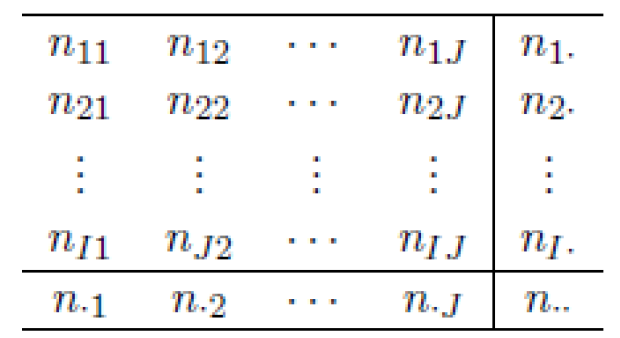

```{r setup, include=FALSE}
options(htmltools.dir.version = FALSE)
```

# Categorical Data Analysis

In categorical data analysis, we consider observations that belong to sets of categories.

#### Examples

- Are carriers of a particular gene more susceptible to cancer?

- Is heart attack incidence associated with blood type?

- Is gender associated with likelihood of promotion?

- Do STEM degrees or humanities degrees have lower unemployment?


---

# Categorical Data Analysis

- __Nominal__ variables have categorical values

- For example, _Blood Type_ takes values over 8 categories (A+, A-, B+, B-, O+, O-, AB+, AB-).

- Each person's measured blood type will belong to exactly one of these categories.

- A sample of 100 individuals may have blood type distributed as:

```{r table1, echo=FALSE, message=FALSE, warnings=FALSE, results='asis'}
tabl <- "
| Blood Type    | A+ | A- | B+ | B- | O+ | O- | AB+ | AB- |
|---------------|:---|:---|:---|:---|:---|:---|:----|:----|
| Count         | 34 | 40 | 7  | 3  | 8  | 7  | 1   | 0   | 
"
cat(tabl) # output the table in a format good for HTML/PDF/docx conversion
```

---

# Review of Multinomial Distribution

- Consider a random vector of count data $X = (N_1, N_2, \dots, N_c)$, where each $N_i$ is a count of elements in category $i$.

- $X$ follows a multinomial distribution if it has probability mass function

$$p(N_1 = n_1, N_2 = n_2, \cdots, N_c = n_c) = \left(\frac{n!}{n_1!n_2!\cdots n_c!}\right) \pi_1^{n_1}\pi_2^{n_2}\cdots \pi_c^{n_c},$$

where 

$$\sum_{i = 1}^c n_i = n$$
$$\sum_{i = 1}^c \pi_i = 1$$

- We write $X \sim Multi(n, (\pi_1, \dots, \pi_c))$.

---

# Review of Multinomial Distribution

__Properties__

$$\mathbb{E}(N_i) = n\pi_i$$
$$\text{Var}(N_i) = n\pi_i(1 - \pi_i)$$
$$\text{Cov}(N_i, N_j) = -n\pi_i\pi_j, i\neq j$$

__Marginal Distribution__

$$N_i \sim Binom(n, \pi_i)$$

__Conditional Distribution__

$$(N_1, \cdots, N_{c - 1}) | (N_c = n_c) \sim Multi\left(n - n_c, \frac{pi_1}{1 - \pi_c}, \dots, \frac{\pi_{c - 1}}{1 - \pi_i}\right)$$

__Note__ that when $c = 2$, the multinomial distribution reduces to the binomial distribution.

---

# Review of Multinomial Distribution

__Example__

The distribution of the blood type data may follow a multinomial:

$$X \sim Multi(100, (0.374,	0.357, 0.085,	0.034, 0.066, 0.063, 0.015, 0.006))$$

The count data from the table is a realization of this random variable from a random sample of 100 people.

```{r table2, echo=FALSE, message=FALSE, warnings=FALSE, results='asis'}
tabl <- "
| Blood Type    | A+ | A- | B+ | B- | O+ | O- | AB+ | AB- |
|---------------|:---|:---|:---|:---|:---|:---|:----|:----|
| Count         | 34 | 40 | 7  | 3  | 8  | 7  | 1   | 0   | 
"
cat(tabl) # output the table in a format good for HTML/PDF/docx conversion
```

---

# Pearson's Chi-squared Test

Consider a two-way contingency table

```{r, out.height=200, fig.align="center", echo=FALSE}

```

where

- $n_{ij}$ is the observed count in row $i$ and column $j$

- $n_{i\cdot} = \sum_{j = 1}^J$ is the total number of observations in row $i$

- $n_{\cdot j} = \sum_{i = 1}^I n_{ij}$ is the total number of observations in column $j$

- $n_{\cdot \cdot} = \sum_{i = 1}^I\sum_{j = 1}^J n_{ij}$ is the total number of observations

---

# Pearson's Chi-squared Test

- If we have two factors, the Chi-squared test can be used to determine:

    + Are the two factors independent?
    
    + Are subpopulations homogeneous (i.e. equally distributed)?

- Which question we are answering depends on the data we have and the goal of the analysis.


---

# Pearson's Chi-squared Test

The test statistic is 

$$T = \sum_{i = 1}^c \frac{(Obs_i - Exp_i)^2}{Exp_i},$$

where

- $c$ is the total number of cells (e.g. $c = IJ$ for an $I\times J$ table),

- $Obs_i$ is the observed count for cell $i$,

- $Exp_i$ is the expected count for cell $i$ under some specific null hypothesis.

***

- The value of $Exp_i$ can be calculated from the MLE of the parameters under the null hypothesis.

---

# Pearson's Chi-squared Test

__Idea of the test__ 

- The Central Limit Theorem tells us that sums of random variables will be approximately normally distributed.

- Quadratic forms of normal random variables will follow a $\chi^2$ distribution.

- Combining these properties, we can derive the (approximate) null distribution for the test statistic

---

# Pearson's Chi-squared Test

__Theoretical Justification__

- Consider a multinomial sample $(n_1, n_2, \dots, n_c)$ of size $n$.

- The marginal distribution of $n_i$ is $Binom(n, \pi_i)$.

- For large $n$, the CLT tells us that

$$\hat \pi = \left(\frac{n_1}{n}, \frac{n_2}{n}, \dots, \frac{n_{c - 1}}{n}\right)^T$$

has an approximate multivariate normal distribution.

---

# Pearson's Chi-squared Test

__Theoretical Justification__

- Let $\Sigma_0$ be the null covariance matrix of $\sqrt{n}\hat\pi$, and let 

$$\pi_0 = (\pi_{10}, \pi_{20}, \dots, \pi_{c - 1, 0})^T$$

be the expectation of $\pi$ under the null hypothesis.

- Then, by the CLT

$$\sqrt{n}(\hat \pi - \pi_0) \to \mathcal{N}(0, \Sigma_0)$$
- Therefore, by results on the distribution of quadratic forms

$$n(\hat\pi - \pi_0)^T\Sigma_0^{-1}(\hat\pi - \pi_0) \to \chi^2_{c - 1}$$

---

# Pearson's Chi-squared Test

__Theoretical Justification__

- The covariance matrix $\Sigma$ of $\sqrt{n}\hat\pi$ has elements

$$\Sigma = \begin{pmatrix} \pi_1(1 - \pi_1) & -\pi_1\pi_2 & \dots & -\pi_1\pi_{c - 1}\\
-\pi_1\pi_2 & \pi_2(1 - \pi_2) & \dots & -\pi_2\pi_{c - 1}\\
\vdots & \vdots & \vdots & \vdots\\
-\pi_1\pi_{c - 1} & \dots & \dots & \pi_{c - 1}(1 - \pi_{c - 1})
\end{pmatrix}$$

- Under a null hypothesis giving values $\pi_0 = (\pi_{10}, \dots, \pi_{c - 1, 0})^T$, we plug in these values into $\Sigma$ to obtain $\Sigma_0$.

- It can be shown that the Pearson Chi-squared test statistic is equal to

$$T = n(\hat\pi - \pi_0)^T\Sigma_0^{-1}(\hat\pi - \pi_0).$$

- Thus, the null distribution is $T \overset{H_0}\sim \chi^2_{c - 1}$.

---

# Pearson's Chi-squared Test for Independence

- Suppose we wish to test whether the factors are independent in a two-way contingency table

- The null hypothesis is

$$H_0: \pi_{ij} = \pi_{i\cdot}\pi_{\cdot j},$$

by the definition of independence

- The likelihood for the multinomial can be written

$$\mathcal{L}(\pi_{11}, \dots, \pi_{IJ}) = \left(\frac{n_{\cdot\cdot}!}{n_{11}!\cdots n_{IJ}!}\right) \pi_{11}^{n_{11}}\pi_{12}^{n_{21}}\cdots \pi_{IJ}^{n_{IJ}}$$

---

# Pearson's Chi-squared Test for Independence

- Under the null hypothesis, the likelihood can be written

$$\mathcal{L}_0 \propto \prod_{i = 1}^I\prod_{j = 1}^J [\pi_{i\cdot}\pi_{j\cdot}]^{n_{ij}}.$$

- The log-likelihood is

$$\begin{aligned}
\ell_0 &= \log(\mathcal{L}_0) = \sum_{i = 1}^I\sum_{j = 1}^J [n_{ij}\log(\pi_{i\cdot}\pi_{\cdot j})] + const\\
&= \sum_{i} \sum_j n_{ij}\log(\pi_{i\cdot}) + \sum_i \sum_j n_{ij}\log(\pi_{\cdot j}) + const\\
&= \sum_i n_{i\cdot} \log(\pi_{i\cdot}) + \sum_j n_{\cdot j}\log(\pi_{\cdot j}) + const
\end{aligned}$$

---

# Pearson's Chi-squared Test for Independence

- It can be shown that the MLEs are

$$\hat\pi_{i\cdot} = \frac{n_{i\cdot}}{n_{\cdot\cdot}}, ~~~ \text{for } i = 1, \cdots, I$$

$$\hat\pi_{\cdot j} = \frac{n_{\cdot j}}{n_{\cdot\cdot}}, ~~~ \text{for } j = 1, \cdots, J.$$

---

# Pearson's Chi-squared Test for Independence

- Thus, 

$$Exp_{ij} = n_{\cdot \cdot}\hat \pi_{ij} = n_{\cdot \cdot}\hat \pi_{i\cdot}\hat\pi{\cdot j} = \frac{n_{i\cdot}n_{\cdot j}}{n_{\cdot\cdot}}$$

- The resulting $\chi^2$ test statistic can be written

$$T = \sum_{i = 1}^I\sum_{j = 1}^J \frac{(n_{ij} - n_{i\cdot}n_{\cdot j})^2}{n_{i\cdot}n_{\cdot j}/ n_{\cdot\cdot}}.$$

- This statistic has reference distribution $T \overset{H_0}\sim \chi^2_{(I - 1)(J - 1)}$ under the null hypothesis of independence.


---

# Pearson's Chi-squared Test for Independence

__Example__

200 students were surveyed on their preference between two political candidates _A_ and _B_.  The following table shows the responses by major subject area.


__Observed Counts__

```{r table4, echo=FALSE, message=FALSE, warnings=FALSE, results='asis'}
tabl <- "
|               | Bio. | Eng. | Soc. Sci. | Other | Totals |
|---------------|:-----|:-----|:----------|:------|:-------|
| A             | 24   | 24   | 17        | 27    | 92     |
| B             | 23   | 14   | 8         | 19    | 64     | 
| Undecided     | 12   | 10   | 13        | 9     | 44     |
| Totals        | 59   | 48   | 38        | 55    | 200    |
"
cat(tabl) # output the table in a format good for HTML/PDF/docx conversion
```

---

# Pearson's Chi-squared Test for Independence

__Observed Counts__

```{r table6, echo=FALSE, message=FALSE, warnings=FALSE, results='asis'}
tabl <- "
|               | Bio. | Eng. | Soc. Sci. | Other | Totals |
|---------------|:-----|:-----|:----------|:------|:-------|
| A             | 24   | 24   | 17        | 27    | 92     |
| B             | 23   | 14   | 8         | 19    | 64     | 
| Undecided     | 12   | 10   | 13        | 9     | 44     |
| Totals        | 59   | 48   | 38        | 55    | 200    |
"
cat(tabl) # output the table in a format good for HTML/PDF/docx conversion
```

__Expected Counts under null hypothesis of independence__

```{r table7, echo=FALSE, message=FALSE, warnings=FALSE, results='asis'}
tabl <- "
|               | Bio.    | Eng.  | Soc. Sci. | Other | Totals |
|---------------|:--------|:----- |:----------|:------|:-------|
| A             | 27.14   | 22.08 | 17.48     | 25.3  | 92     |
| B             | 18.88   | 15.36 | 12.16     | 17.60 | 64     | 
| Undecided     | 12.98   | 10.56 | 8.36      | 12.10 | 44     |
| Totals        | 59      | 48    | 38        | 55    | 200    |
"
cat(tabl) # output the table in a format good for HTML/PDF/docx conversion
```

---

# Pearson's Chi-squared Test for Independence

- The statistic is $T = \sum \frac{(Obs - Exp)^2}{Exp} = 6.68$

- Since $I = 3, J = 4$, the null distribution is $\chi^2_{6}$, where $6 = (I - 1)(J - 1)$

- The upper $5\%$ tail of $\chi^2_6$ has cutoff 12.59.

- We conclude then that there is insufficient evidence to reject the hypothesis that candidate preference is independent of major type, at significance level 0.05.

- That is, we conclude that candidate preference is associated with major type, at significance level 0.05.